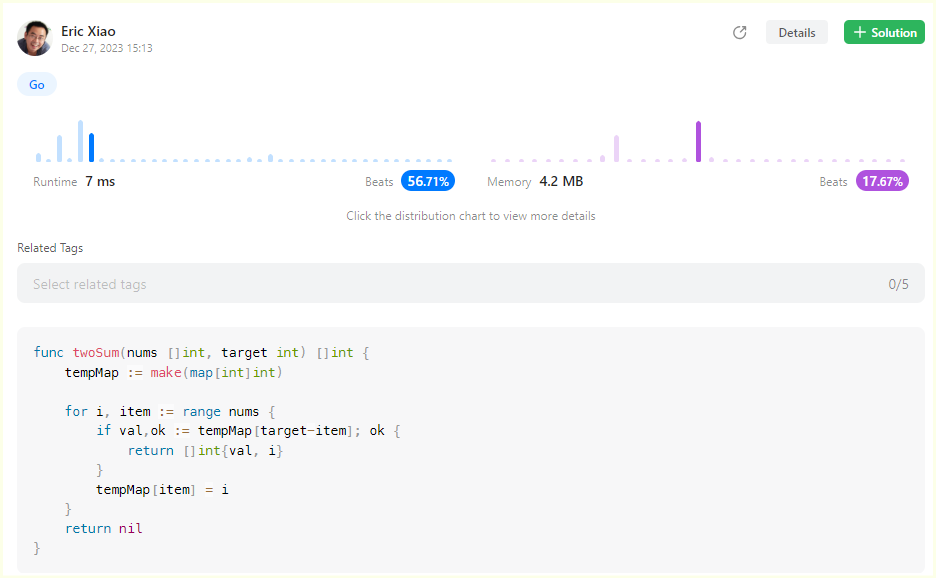
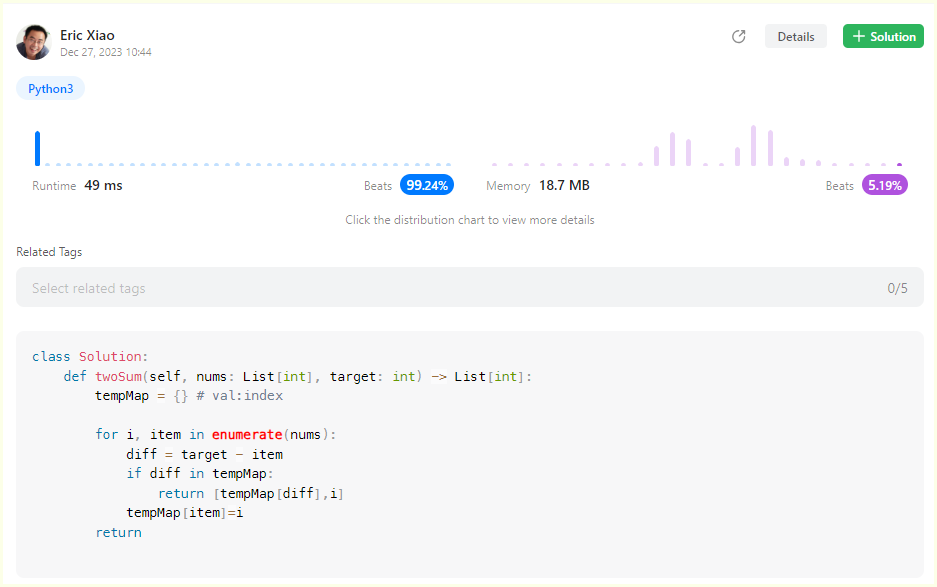

# 1.Two Sum

## [The link for the Two Sum coding problem](https://leetcode.com/problems/two-sum/)


## Approach to this one:


## Go:


```go
func twoSum(nums []int, target int) []int {
    tempMap := make(map[int]int)

    for i, item := range nums {
        if val,ok := tempMap[target-item]; ok {
            return []int{val, i}
        }
        tempMap[item] = i
    }
    return nil
}
```

## Python3:


```python
class Solution:
    def twoSum(self, nums: List[int], target: int) -> List[int]:
        tempMap = {} # val:index
        
        for i, item in enumerate(nums):
            diff = target - item
            if diff in tempMap:
                return [tempMap[diff],i]
            tempMap[item]=i
        return 
```