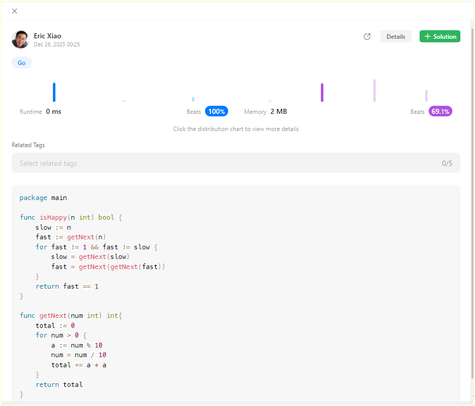
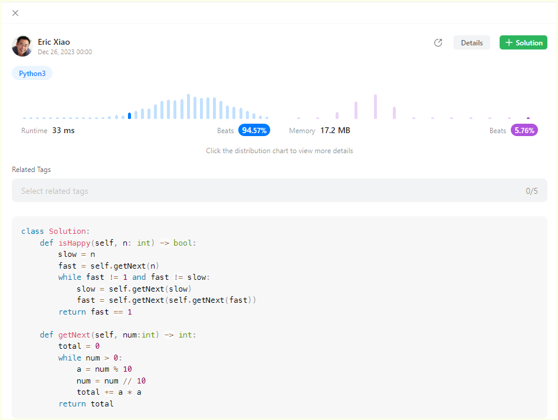

# 202.Happy Number

## Go:



```go
package main

func isHappy(n int) bool {
    slow := n
    fast := getNext(n)
    for fast != 1 && fast != slow {
        slow = getNext(slow)
        fast = getNext(getNext(fast))
    }
    return fast == 1
}

func getNext(num int) int{
    total := 0
    for num > 0 {
        a := num % 10
        num = num / 10
        total += a * a
    }
    return total
}
```

## Python3:



```python
class Solution:
    def isHappy(self, n: int) -> bool:
        slow = n
        fast = self.getNext(n)
        while fast != 1 and fast != slow:
            slow = self.getNext(slow)
            fast = self.getNext(self.getNext(fast))
        return fast == 1

    def getNext(self, num:int) -> int:
        total = 0
        while num > 0:
            a = num % 10
            num = num // 10
            total += a * a
        return total
```


